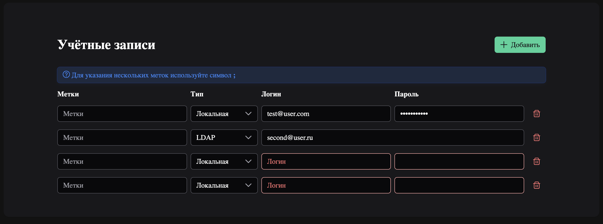

# Account Manager – Vue 3 / TS / Pinia / PrimeVue

Форма управления учётными записями.  
Позволяет добавлять, редактировать и удалять записи локально (данные сохраняются в `localStorage`).

<div align="center">
  
</div>

---

## ✨ Стек

| Технология                                                        | Версия | Назначение          |
| ----------------------------------------------------------------- | ------ | ------------------- |
| [Vue 3](https://vuejs.org/) + Composition API                     | `^3.x` | Фреймворк           |
| [TypeScript](https://www.typescriptlang.org/)                     | `^5.x` | Язык                |
| [Vite](https://vitejs.dev/)                                       | `^5.x` | Билдер / Dev-сервер |
| [Pinia](https://pinia.vuejs.org/) + `pinia-plugin-persistedstate` | `^2.x` | Хранилище c persist |
| [PrimeVue](https://primevue.org/) + PrimeFlex + PrimeIcons        | `^3.x` | UI-компоненты       |
| ESLint, Prettier                                                  | —      | Качество кода       |

---

## 🚀 Запуск проекта

```bash
# 1. Клонируем репозиторий
git clone https://github.com/AydarVess/AccountForm.git
cd AccountForm

# 2. Устанавливаем зависимости
npm i

# 3. Стартуем dev-сервер
npm dev
# → http://localhost:5173
```
